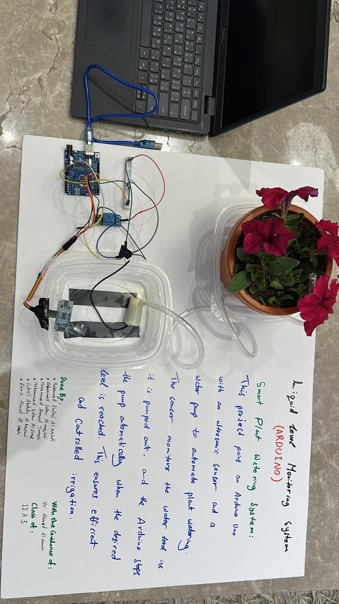

# 🌱 arduino-smart-watering-system

Automated watering system built with Arduino, an HC-SR04 ultrasonic sensor, a relay module, and an electric water pump.

The system controls water flow efficiently by activating the pump through a serial command and stopping it automatically once the water level drops by approximately 3 cm.

## 🔍 Overview

This project uses an ultrasonic sensor to monitor water level while a pump is running. When the system receives the `ON` command through the Arduino Serial Monitor, it activates the pump and records the starting distance from the sensor to the water surface.

As the pump drains water, the measured distance increases. Once the distance increases by 3 cm from the starting point, the system automatically turns the pump off.

## ⚙️ Features

- Serial-controlled pump activation  
- Water level measurement using HC-SR04  
- Automatic shutoff after ~3 cm level drop  
- Relay-controlled pump switching  
- Basic sensor-error safety behavior  
- Real-time feedback via Serial Monitor  

## 🧰 Components Used

- Arduino Uno  
- HC-SR04 ultrasonic sensor  
- Electric water pump  
- Relay module  
- Breadboard  
- Jumper wires (male-male, male-female, female-female)  
- USB connection (Arduino powered via laptop)  

## 🧠 How It Works

1. The system starts with the pump off  
2. The ultrasonic sensor continuously measures distance to the water surface  
3. When `ON` is entered in the Serial Monitor, the pump activates  
4. The initial water level (distance) is stored  
5. While running, the system keeps measuring distance  
6. If the distance increases by 3 cm, the pump stops automatically  
7. If invalid sensor readings occur, the pump is stopped as a safety measure  

## 💻 Code

The Arduino implementation is available in `111water_pump.ino`.

## 🔌 Pin Configuration

- HC-SR04 Trigger → Pin 5  
- HC-SR04 Echo → Pin 6  
- Relay Module → Pin 2  

## ▶️ Usage

1. Connect all components to the Arduino  
2. Upload the code  
3. Open Serial Monitor (9600 baud)  
4. Type `ON` and press enter  
5. The pump will run and stop automatically based on water level change  

## 🚀 Possible Improvements

- Add a soil moisture sensor for plant-based decisions  
- Add a manual OFF command  
- Use an external power supply for the pump  
- Add a display (LCD/OLED) for live readings  
- Build an enclosure for better structure  

## 📄 License

Open for learning and educational use.
